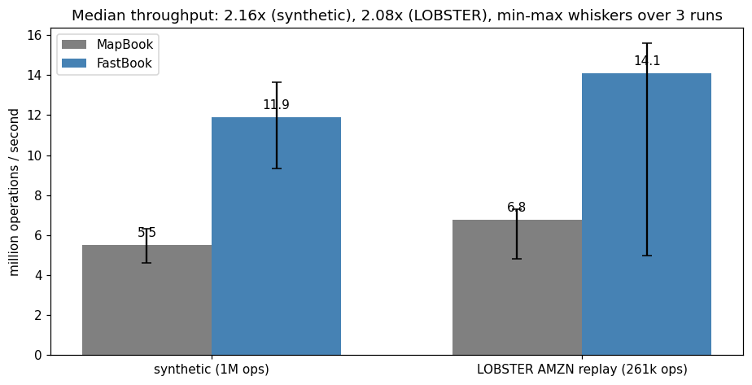
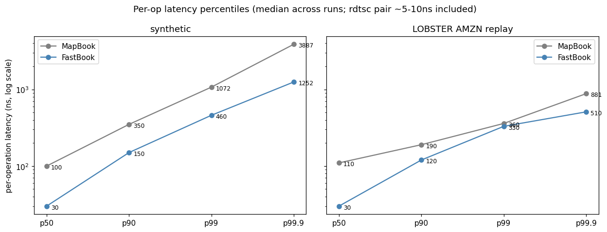
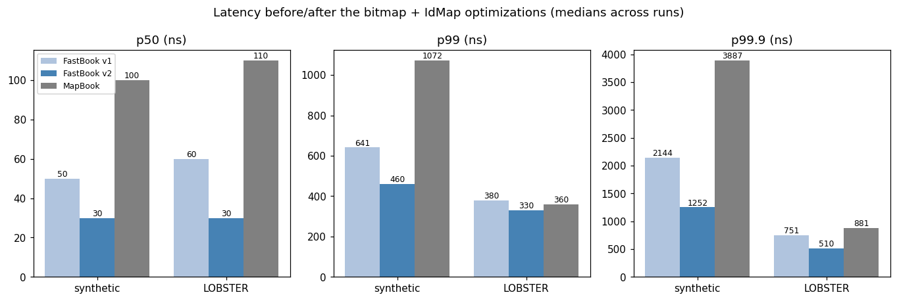

# matching-engine

[](https://github.com/dmitridefreitas-dev/matching-engine/actions/workflows/ci.yml)
[](LICENSE)

📄 **[Report (PDF)](analysis/matching-engine-report.pdf)** · 📓 [analysis notebook](analysis/benchmarks.ipynb)

**A C++20 price-time-priority limit-order-book matching engine, built twice on
purpose: a readable `std::map` reference and a cache-aware optimized engine —
differentially fuzzed against each other until indistinguishable, then benchmarked
on a replayed LOBSTER market-data day with the methodology stated before the
numbers.** Limit and market orders, cancels, priority-preserving reduces, partial
fills. Header-only, no dependencies beyond GoogleTest for the tests; ASan/UBSan run
on every CI build.

## The two implementations

| | `MapBook` (reference) | `FastBook` (optimized) |
|---|---|---|
| price levels | `std::map` (tree walk per lookup) | **contiguous price ladder** — one array slot per tick, level lookup is one add + one load |
| FIFO queue per level | `std::list` (heap node per order) | **intrusive doubly-linked list** inside an **object pool** with a free list — zero steady-state allocation, O(1) mid-queue cancel |
| best bid/ask | `map.begin()` | ladder indices re-found via an **occupancy bitmap** — 64 price ticks scanned per `countr_zero` |
| id → order lookup | `std::unordered_map` | **open-addressed `IdMap`** — linear probing, Fibonacci hashing, backward-shift deletion (tombstone-free under churn), itself differentially tested against the STL |
| role | visibly correct; the **oracle** | the engine being proven and measured |

Same semantics contract, enforced twice over: one GoogleTest suite runs against both
implementations via typed tests, and a **differential fuzzer** feeds identical random
order streams to both engines, asserting after *every operation* that fills, return
values, and (at checkpoints) full book snapshots match exactly, plus invariants — no
crossed book, levels sorted, FIFO preserved, no zero-quantity residents, quantity
conservation on every trade. 25 seeds × 20k ops plus a 200k-op session per test run,
under sanitizers in CI. A failure prints its seed: every counterexample is one
command from a deterministic repro.

## Measured results

Setup: AMD Ryzen 7 7730U (Windows 11 laptop), clang++ (LLVM-MinGW) `-O2`, single
thread pinned to one core, full warmup replay excluded, median of 3 runs (min–max
whiskers), identical op streams per engine. Latency is TSC-timed per operation —
Windows `steady_clock` has 100ns granularity, which would quantise the percentiles —
and the ~5–10ns rdtsc-pair cost is *included*. Full details in the
[report](analysis/matching-engine-report.pdf).

Flows: **synthetic** (1M ops, 55/25/10/10 submit/cancel/market/reduce around a
random-walking mid, heavy-tailed sizes) and a **LOBSTER replay** — the full AMZN
2012-06-21 sample day (269,748 messages → 261k engine ops after mapping; executions
synthesised as opposite-side marketable orders; `scripts/download_lobster.py`
fetches the file).

| flow | engine | throughput (median) | p50 | p90 | p99 | p99.9 |
|---|---|---|---|---|---|---|
| synthetic | MapBook | 5.5 M ops/s | 100 ns | 350 ns | 1072 ns | 3.9 µs |
| synthetic | **FastBook** | **11.9 M ops/s (2.16×)** | **30 ns** | **150 ns** | **460 ns** | **1.3 µs** |
| LOBSTER | MapBook | 6.8 M ops/s | 110 ns | 190 ns | 360 ns | 881 ns |
| LOBSTER | **FastBook** | **14.1 M ops/s (2.08×)** | **30 ns** | **120 ns** | **330 ns** | **510 ns** |





**Optimization, with receipts.** The first benchmarked version measured two specific
weaknesses and reported them instead of hiding them: on the sparse LOBSTER book
(AMZN ticks in $0.0001, so occupied levels sit hundreds of empty ticks apart) the
best-level rescan made FastBook's p99 *worse* than MapBook's, and the
`std::unordered_map` id lookup was a chokepoint both designs paid. Version 2 fixed
exactly those two things — the occupancy bitmap and `IdMap` — and nothing else, so
the deltas are attributable: LOBSTER p99 380 → 330 ns and p99.9 751 → 510 ns (both
now *better* than the tree), p50 halved again to 30 ns, LOBSTER throughput
10.7 → 14.1 M ops/s. The v1 baseline is preserved in
`results/benchmarks_v1_baseline.csv`, and the differential fuzzer is what made the
surgery safe: swap the guts, rerun, indistinguishable.



Rare 0.5–10ms max-latency spikes on both engines are page faults and OS preemption
on a desktop laptop, and whole-replay throughput medians carry more OS noise than
the million-sample latency percentiles; this repo's claim is the *relative*
comparison under identical conditions, not absolute HFT figures.

## Build and run

```bash
cmake -B build -DCMAKE_BUILD_TYPE=Release
cmake --build build -j
ctest --test-dir build                      # 33 tests
./build/lob_bench --ops 1000000 --seed 42   # synthetic benchmark

python scripts/download_lobster.py          # fetch the AMZN sample (~11 MB)
./build/lob_bench --flow lobster --file data/AMZN_message.csv
```

Sanitized build: `cmake -B build -DLOB_SANITIZE=ON -DCMAKE_BUILD_TYPE=Debug` — the
same configuration CI runs on every push (gcc + clang × Release + ASan/UBSan).

## Semantics contract (what the fuzzer holds both engines to)

- **Price-time priority**: better price first; FIFO within a level.
- Fills execute at the **maker's** price — taker price improvement, as on exchanges.
- Limit remainders **rest**; market remainders are **discarded**.
- `reduce` lowers quantity **in place, preserving time priority** (exchange
  semantics); size-ups and price changes are cancel+replace, composed by the caller.
- Integer ticks and integer quantities throughout — no floating point in the book.

## Limitations / next steps

- **Single-threaded matching core only** — no sessions, gateway, or persistence;
  the interesting concurrency question (SPSC queue in front of a single matching
  thread, the standard exchange shape) is deliberately out of scope.
- **MapBook keeps its `std::unordered_map`** — on purpose: it is the *reference*,
  and its job is to be obvious, not fast.
- **No self-trade prevention, IOC/FOK, or iceberg orders** — semantics extensions
  that slot into the same differential harness.
- LOBSTER replay synthesises aggressors from execution prints (stated in
  `lobster.hpp`) — realistic *load*, not a tick-exact reconstruction of the tape.
